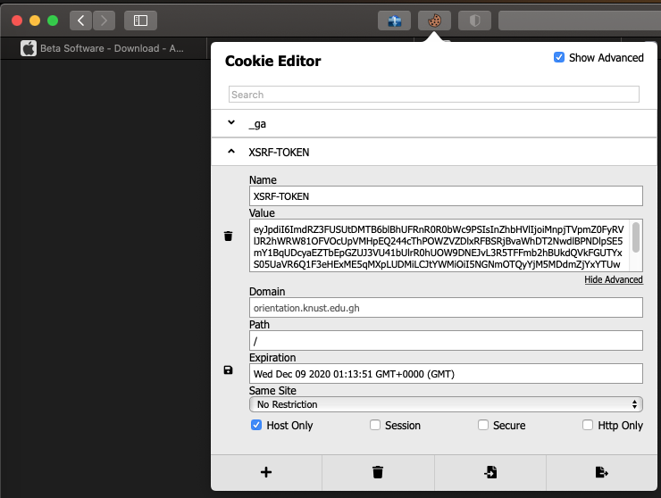

	<h2 align="center">Cookie-Editor Extension for Safari</h2>

*NB:* The latest version of the project can be found here: https://github.com/Moustachauve/cookie-editor

### Development
1. Clone and build project with Xcode 12 or greater.
2. Enable "**Develop**" mode in Safari.
3. Allow unsigned extension.
4. Build and run the project to install the extension.

### Acknowledgement
<a href="https://github.com/Moustachauve/cookie-editor" target="_blank">https://github.com/Moustachauve/cookie-editor</a>
